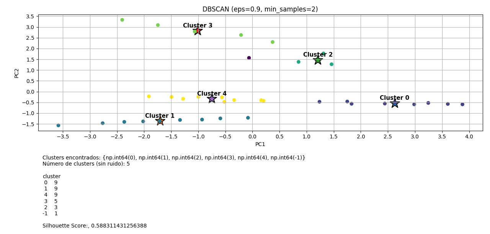

# DBSCAN Clustering & Analysis Tool

A Python-based implementation of the **DBSCAN** (Density-Based Spatial Clustering of Applications with Noise) algorithm, applied to patient classification. The script processes multi-dimensional medical datasets, performs dimensionality reduction for visualization, and generates an automated statistical report of the identified clusters.

<p align="center">
  
</p>

<p align="center">
  PCA projection with DBSCAN cluster separation
</p>

---

## Features

- **Data Normalization** — Uses `StandardScaler` so variables with different scales don't bias the distance calculations.
- **Density-Based Clustering** — DBSCAN finds clusters of arbitrary shapes and flags outliers as noise (label `-1`).
- **Dimensionality Reduction** — PCA projects high-dimensional data into 2D for intuitive plotting.
- **Automated Statistical Report** — Generates a `cluster_report.txt` with per-cluster stats:
  - Cluster size
  - Mean and standard deviation
  - Interquartile range (Q1 and Q3)
- **Performance Evaluation** — Calculates the **Silhouette Score** (noise points excluded) to measure how well-defined the clusters are.
- **Visual Analytics** — Produces a 2-panel plot: a PCA scatter view with labeled centroids, and a metrics summary panel.

---

## Requirements

Python 3.x and the following libraries:

```bash
pip install pandas scikit-learn matplotlib numpy
```

---

## Usage

1. Clone the repository:
   ```bash
   git clone https://github.com/pinkie3141592/DBSCAN-for-patient-classification.git
   cd DBSCAN-for-patient-classification
   ```

2. Place your dataset (`.csv`) in the `/data` folder.

3. Open `main.py` and update the file path:
   ```python
   file_path = r'data/your_database.csv'
   ```

4. Run the script:
   ```bash
   python main.py
   ```

5. Check your outputs:
   - **Plot** — displayed on screen with PCA clusters and centroids
   - `cluster_report.txt` — statistical summary written to the project folder

---

## Data Structure

The script expects a `.csv` file located in the `data/` directory. Columns are renamed internally to a generic `var_n` format for processing, while original column names are preserved for the final report.

---

## How It Works

### Preprocessing
Columns are mapped to generic names (`var_1`, `var_2`, ...) internally, while a reference to the original names is kept for readable report output.

### Clustering
DBSCAN groups points based on density, making it well-suited for medical data where clusters may have irregular shapes and real outliers exist.

### Visualization
- **Top panel** — 2D PCA projection of all clusters, with centroids marked as stars ★
- **Bottom panel** — summary metrics: number of clusters found and Silhouette Score

### Report Export
The `export_cluster_ranges` function iterates over all valid clusters (excluding noise), computes descriptive statistics, and writes a formatted `.txt` report.

---

## Example Output

```
Cluster 0 — 142 patients
  var_1 (age):        mean=54.3  std=8.1   Q1=48.0  Q3=61.0
  var_2 (glucose):    mean=110.2 std=15.4  Q1=99.0  Q3=121.5
  ...

Cluster 1 — 89 patients
  ...

Silhouette Score: 0.62
```

---

## Notes

- Noise points (label `-1`) are excluded from the report and silhouette calculation.
- DBSCAN parameters (`eps` and `min_samples`) may need tuning depending on your dataset's density.
